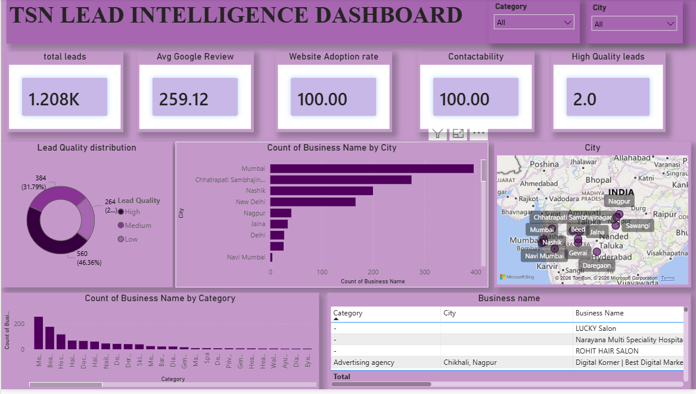

# Tap Savvy Lead Dashboard

## Overview
This dashboard provides insights into lead quality, business performance, website adoption, contactability, and geographic distribution of leads.

---

## Filters
- Lead Quality Filter
- Location/Category Filter

---

## KPI Cards

### Total Leads
Displays the total number of leads available in the dataset.

### Avg Google Review
Shows the average Google review rating across businesses.

### Website Adoption Rate
Indicates the percentage of businesses with a website.

### Contactability
Measures the percentage of businesses that can be contacted.

### High Quality Leads
Displays the count of leads classified as high quality.

---

## Visualizations

### Lead Quality Distribution (Donut Chart)
Breakdown of leads by quality category.

### Lead Analysis (Bar Chart)
Compares lead counts across different categories.

### Trend/Comparison Analysis (Column Chart)
Shows lead performance across selected dimensions.

### Business Name Table
Detailed list of businesses and associated lead information.

### Geographic Distribution (Map)
Displays the location-wise distribution of leads on a map.

---

## Key Metrics Tracked
- Total Leads
- High Quality Leads
- Contactability Rate
- Website Adoption Rate
- Average Google Review Score
- Geographic Lead Distribution

---

## Dashboard Purpose
The dashboard helps users:
1. Identify high-quality leads.
2. Analyze business contactability.
3. Monitor website adoption among businesses.
4. Evaluate Google review performance.
5. Explore lead distribution geographically.
